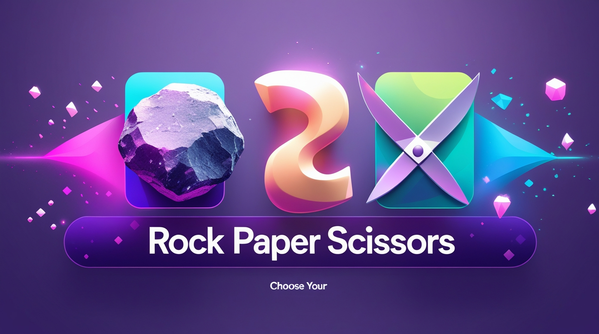

<div align="center">

# Rock Paper Scissors Game 🎮




A visually stunning, interactive Rock Paper Scissors game built with vanilla HTML, CSS, and JavaScript. Features beautiful animations, responsive design, and an intuitive user interface.

</div>

## 🌟 Features

### Core Gameplay
- **Classic Rock Paper Scissors mechanics** - Traditional game rules faithfully implemented
- **Score tracking** - Keep track of wins for both player and computer
- **Real-time feedback** - Instant visual and textual feedback for each round
- **Computer AI** - Randomized computer opponent for fair gameplay

### Visual Design
- **Modern gradient backgrounds** - Eye-catching purple gradient with animated particles
- **Glassmorphism effects** - Frosted glass aesthetic on score displays
- **Smooth animations** - Multiple animation effects including:
  - Floating background particles
  - Shimmer effects on the header
  - Bounce animations on selection
  - Celebration/shake animations for wins/losses
  - Score update pulsing effects
  - 3D hover transformations

### User Experience
- **Interactive hover effects** - Dynamic visual feedback on all interactive elements
- **Keyboard support** - Play using keyboard shortcuts (R, P, S)
- **Responsive design** - Fully optimized for desktop, tablet, and mobile devices
- **Visual selection feedback** - Selected choices highlight with animations
- **Emoji integration** - Fun emojis enhance the gaming experience

## 🎯 How to Play

### Using Mouse/Touch
1. Click on one of the three choices: Rock 🪨, Paper 📄, or Scissors ✂️
2. The computer will automatically make its choice
3. The winner is determined based on classic rules:
   - Rock beats Scissors
   - Scissors beats Paper
   - Paper beats Rock
4. Scores update automatically after each round

### Using Keyboard
- Press **R** for Rock
- Press **P** for Paper
- Press **S** for Scissors

## 📁 Project Structure

```
RockPaperScissors/
│
├── index.html          # Main HTML structure
├── style.css           # All styling and animations
├── app.js             # Game logic and interactivity
└── images/            # Game choice images
    ├── rock.png
    ├── paper.png
    └── scissors.png
```

## 🚀 Getting Started

### Prerequisites
- A modern web browser (Chrome, Firefox, Safari, Edge)
- No additional dependencies or installations required

### Installation

1. **Clone or download** this repository to your local machine
   ```bash
   git clone https://github.com/yourusername/rock-paper-scissors.git
   ```

2. **Navigate** to the project directory
   ```bash
   cd RockPaperScissors
   ```

3. **Add images** - Place your rock, paper, and scissors images in the `images/` folder:
   - `images/rock.png`
   - `images/paper.png`
   - `images/scissors.png`

4. **Open** `index.html` in your web browser
   - Double-click the file, or
   - Right-click and select "Open with" your preferred browser

### Alternative: Using a Local Server
For the best experience, serve the files using a local server:

```bash
# Using Python 3
python -m http.server 8000

# Using Node.js (with http-server installed)
npx http-server

# Using PHP
php -S localhost:8000
```

Then open `http://localhost:8000` in your browser.

## 💻 Technical Details

### Technologies Used
- **HTML5** - Semantic markup structure
- **CSS3** - Advanced styling with:
  - CSS Grid and Flexbox for layout
  - Keyframe animations
  - CSS transforms and transitions
  - Gradient backgrounds
  - Backdrop filters (glassmorphism)
- **Vanilla JavaScript** - Game logic without frameworks

### Key JavaScript Functions

| Function | Purpose |
|----------|---------|
| `genCompChoice()` | Generates random computer choice |
| `playGame(userChoice)` | Main game logic handler |
| `showWinner(userWin, userChoice, compChoice)` | Updates scores and displays results |
| `drawGame()` | Handles tie scenarios |
| `getChoiceEmoji(choice)` | Returns emoji for each choice |

### CSS Animations

- `float` - Background particle movement
- `shimmer` - Header light effect
- `pulse` - Button press feedback
- `bounce` - Selection animation
- `celebrate` - Win animation
- `shake` - Lose animation
- `wiggle` - Draw animation
- `rotate` - Score hover effect
- `scoreUpdate` - Score increment animation

## 🎨 Customization

### Changing Colors
Edit the gradient values in `style.css`:

```css
/* Main background */
body {
  background: linear-gradient(135deg, #667eea 0%, #764ba2 100%);
}

/* Header */
h1 {
  background: linear-gradient(135deg, #1e3c72, #2a5298);
}
```

### Modifying Messages
Update message text in `app.js`:

```javascript
// Win message
msg.innerText = `🎉 You win! ${getChoiceEmoji(userChoice)} beats ${getChoiceEmoji(compChoice)}`;

// Lose message
msg.innerText = `😢 You lose! ${getChoiceEmoji(compChoice)} beats ${getChoiceEmoji(userChoice)}`;

// Draw message
msg.innerText = "🤝 It's a draw! Great minds think alike!";
```

### Adjusting Animation Speed
Modify animation durations in `style.css`:

```css
.choice {
  transition: all 0.3s cubic-bezier(0.25, 0.46, 0.45, 0.94);
}
```

## 📱 Responsive Breakpoints

- **Desktop**: Full experience with all animations (> 768px)
- **Tablet**: Optimized layout with smaller elements (768px - 481px)
- **Mobile**: Vertical layout for better touch interaction (< 480px)

## 🐛 Known Issues & Limitations

- Images must be provided separately (not included in repository)
- No persistent score storage (scores reset on page reload)
- Single-player mode only (vs computer)

## 🔮 Future Enhancements

- [ ] Add sound effects for selections and outcomes
- [ ] Implement score persistence using localStorage
- [ ] Add difficulty levels (Easy/Medium/Hard)
- [ ] Include multiplayer mode
- [ ] Add game statistics and history
- [ ] Implement best-of-X rounds mode
- [ ] Add more game variants (Rock-Paper-Scissors-Lizard-Spock)
- [ ] Dark/Light theme toggle

## 🤝 Contributing

Contributions are welcome! Feel free to:
1. Fork the repository
2. Create a feature branch (`git checkout -b feature/AmazingFeature`)
3. Commit your changes (`git commit -m 'Add some AmazingFeature'`)
4. Push to the branch (`git push origin feature/AmazingFeature`)
5. Open a Pull Request

## 👤 Author

Soumen nandi
- Email: soumennandi633@gmail.com

## 🙏 Acknowledgments

- Inspired by classic Rock Paper Scissors game
- Design inspired by modern UI/UX trends
- Built as a learning project for web development

## 📞 Support

If you encounter any issues or have questions:
- Open an issue on GitHub
- Check existing issues for solutions
- Contact the author directly

---

Made with ❤️ and JavaScript

**Enjoy the game!** 🎮✨
